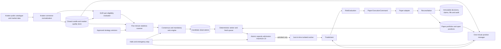
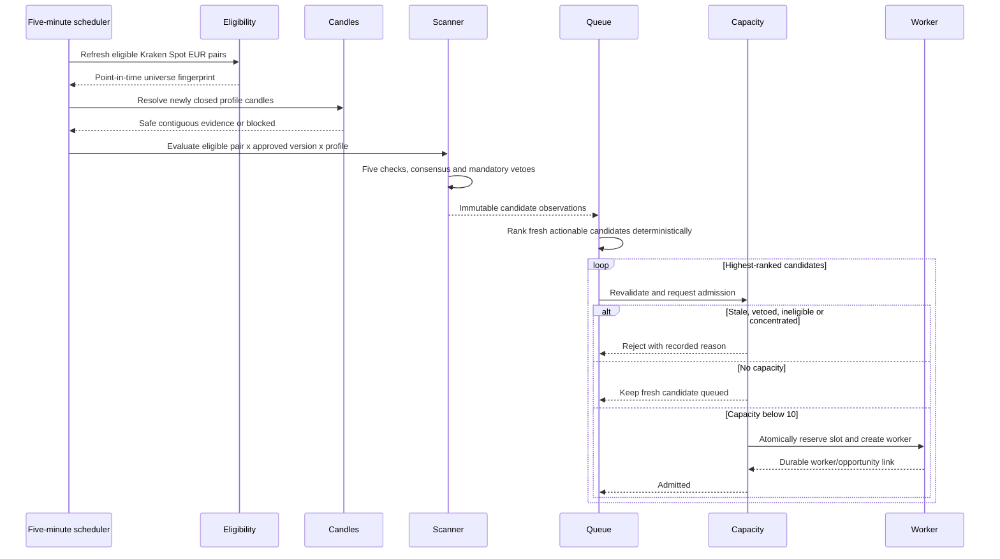
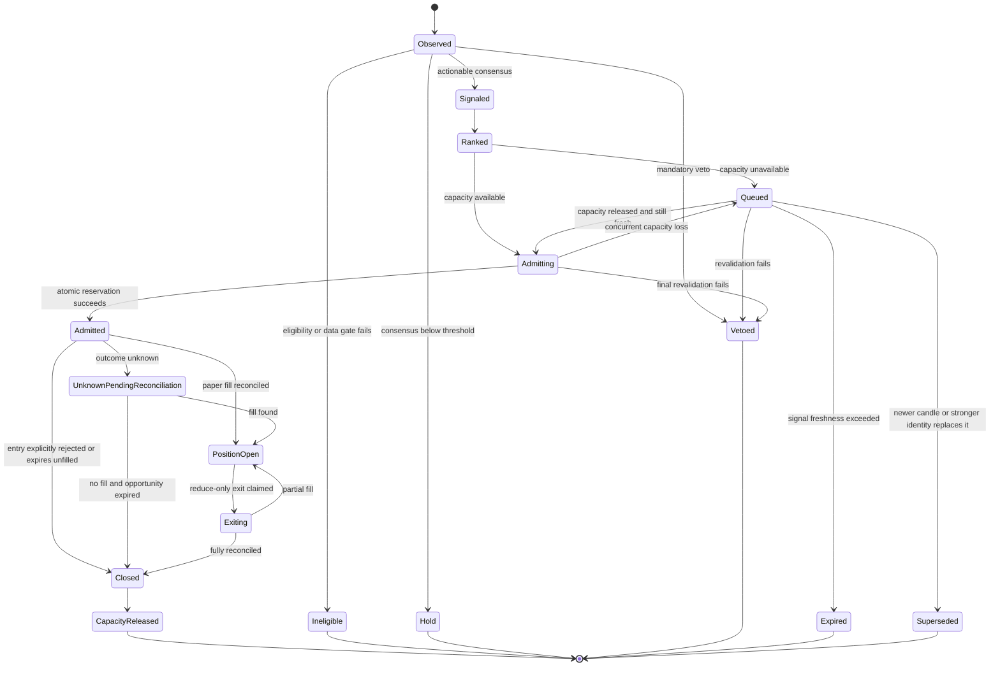

# Continuous Kraken Paper Opportunity Scanner

Status: **implemented for paper trading**. Starting paper training now enables
the scanner with zero waiting workers. The market-data host performs one
idempotent scan per closed five-minute boundary after a 30-second public REST
settlement grace, ranks fresh opportunities, and persists only admitted
opportunities into the owner's existing activation row. It logs completion
only when a new scan is persisted; periodic checks of an already recorded
boundary do not report a second zero-result scan.
The experiment host creates isolated workers from those durable admissions.
Its paper pipeline stages and audit records are retained in SQL; a claimed or
unknown execution freezes the entire worker, including later signal candles,
protective exit attempts, and scanner slot release, until reconciled.
Competing worker claims use a serializable SQL worker-range lock, so a second
host cannot claim another candle before the first outcome is resolved.
Protective exits keep observing stopped owners with open running, paused, or
failed paper workers until the position is flat. This is not a guarantee of
continuous unattended operation: the market-data and experiment hosts still
need independent supervision. The web administrator's halt decisions persist as immutable SQL audit
events and are consulted by the experiment host on every paper risk check.
Emergency and scoped halts block exposure-increasing orders without blocking
a verified position-reducing protective sell.

## 1. Purpose and boundaries

The scanner continuously searches the current eligible Kraken Spot EUR
cryptocurrency universe for paper-trading opportunities. Default slots use ten
platform-authored families; the approved three-swing channel/RSI divergence
family can replace one through owner-scoped worker configuration, even while
scanning or while paper positions are open. Scanning,
HOLD outcomes, bearish Spot signals, rejected signals, and queued opportunities consume **no
experiment worker slots**.

An isolated worker is created only when one concrete opportunity has passed:

1. closed-candle bullish consensus at or above the strategy's BUY threshold;
2. every mandatory veto;
3. deterministic cross-universe ranking;
4. freshness and eligibility revalidation;
5. portfolio and correlation limits;
6. bounded concentration checks; and
7. exact closed-candle signal and one-minute protection windows persisted and
   verified against SQL (a conflicting or missing candle blocks admission); and
8. optimistic atomic admission under the ten-position ceiling.

The worker exists only for the admitted position lifecycle. It is not left
waiting on its former pair after the position is durably closed and reconciled.
The mandatory paper risk stage uses the worker's real fake-cash balance and
the existing position quantity multiplied by the attested closed price as
current notional exposure. A mismatched worker/portfolio quantity or a buy
larger than available fake cash fails before the simulated adapter. If a
confirmed fill cannot be reconciled to a valid cash update (for example,
unexpected fees), its execution association is marked unknown and requires
manual reconciliation; it is never reported as a rejected order or retried.
An open worker position without a matching approved protective plan is
flagged `Unprotected` in the overview and cannot receive automatic additions.
The worker monitor shows `RequiresReconciliation` even for a flat or failed
worker. An operator must first verify the simulated adapter fill, durable
worker ledger, portfolio, and claim. There is no automatic reconciliation or
audited browser control to clear an unknown outcome, and a terminal claim
cannot be rewritten through the normal execution ledger. Keep the worker
frozen until a separately reviewed recovery path establishes its outcome;
do not edit SQL status or retry the same decision.
The authenticated owner-scoped worker detail shows the unresolved claim's
status, strategy, decision UTC, correlation ID and any recorded command ID
for investigation. It separately looks up owner-scoped durable execution
command IDs under that correlation; "none found" is distinguished from
"not inspected". It likewise shows owner-scoped durable portfolio-update
command IDs, separately distinguishing "none found" from "not inspected".
It also reads owner-scoped paper-trade audit action names under that
correlation, without exposing the audit's detail fields. It does not expose
command or portfolio payloads or raw claim details,
or offer a retry. A missing command ID, portfolio update, or audit record
does not prove no paper fill occurred.
New worker-host paper submissions append a separate immutable `Execution`
stage immediately after the simulated adapter returns. It contains only the
command ID, outcome, filled quantity, modeled price and fee, and UTC time;
no arbitrary adapter failure text or exchange credentials are persisted.
The frozen-worker detail reads this stage by owner and correlation and marks
it "not inspected" if the durable reader is unavailable. A write failure
leaves the original claim unresolved, even if the in-memory adapter filled;
the command is not submitted again. Earlier submissions have no such stage,
and a missing stage does not prove there was no simulated fill.
The pipeline treats the execution outcome enum, not a free-form status label,
as authoritative when freezing an unknown submission. A timeout reported
under another status label cannot be mistaken for a proven rejection.
The shared execution pipeline also keeps an accepted but unfilled order and
inconsistent adapter outcomes out of portfolio updates. It returns a
reconciliation requirement and, when a reconciliation repository is
configured, records `New` for an accepted order or `Unknown` for
contradictory evidence, rather than treating adapter success as proof of a
fill. This does not enable live trading.
The frozen-worker detail also highlights contradictions among available
command IDs, simulated outcomes, worker-ledger entries, portfolio deltas,
fees and success audit actions. No contradiction reported means only that
the records present did not disagree: readers may be unavailable, records
may be missing (including on older submissions), and independent exchange
or adapter reconciliation is still required. The report is read-only and
never unfreezes a claim or retries an order.
New automated paper worker-ledger entries use the execution command ID as
their unique entry ID. The diagnostic compares that ID to a claim and its
durable command records; older entries do not carry this correlation. Even
a matching entry alone does not establish that worker cash, portfolio and
audit records all reconcile.
Each completed scan persists its bounded eligible-universe membership in the
activation ledger. New ranking-based admissions also pin the exact member
list in their slot, stage each member's closed daily series in the durable
store, and replay only that list in the worker. Ranking-series staging does
not require one-minute protection history for non-traded markets. Older
unversioned slots retain their legacy membership recovery.
Subscription backfill now accepts a contiguous window only when its final
closed candle ends at the requested UTC boundary; an older complete-looking
window is retried rather than reported current.
Kraken's REST catalogue still calls Bitcoin `XBT` and Dogecoin `XDG`,
whereas its public WebSocket v2 channels require `BTC` and `DOGE`. The
connector translates subscription and order-book symbols at the WebSocket
boundary and maps closed candles back to the original stored worker symbol;
REST history resolves both names to Kraken's exact native pair identifier.
No portfolio or worker position is silently renamed.

This implementation is paper-only. It does not authorize live orders, Futures, shorts,
margin, leverage, transfers, withdrawals, user strategy code, or automatic
strategy approval.

## 2. Timing model

| Activity | Cadence | Evidence |
|---|---|---|
| Catalogue and eligibility refresh | Every 5 minutes and on status/data-health events | Current Kraken catalogue, exchange filters, rolling/median liquidity, spread, slippage estimate, data health |
| Opportunity scan | Every 5 minutes | Only strategy profiles with a newly closed signal candle |
| Slow regime/ranking data | On its native closed interval | Exact strategy profiles use closed 1h, 4h and 1d regime/ranking evidence |
| Active-position management | Every newly closed 1-minute candle | Stop, target, trailing, invalidation, staleness and safety state |
| UI current-price refresh | At most every minute | Latest safe closed 1-minute mark |

A scheduler tick is not a signal identity. If no new signal candle has closed,
the scanner records no new decision. All timestamps and candle boundaries are
UTC. Derived 10-minute candles contain exactly ten contiguous, safe, closed
1-minute candles aligned to a documented UTC ten-minute boundary.
Entry is modeled only after the signal candle closes. The EMA scalp profile may
use a subsequently closed 1-minute candle as execution confirmation, but a
1-minute candle never creates a directional entry signal.

## 2.1 Compiled strategy versions

New regime ensemble admissions use compiled version 5 and pin their selected
components to version 4 while the ensemble has an independent four-hour
structural plan rather than a component-specific stop;
new standalone EMA continuation,
Donchian breakout, Bollinger reversion, RSI pullback, MACD acceleration,
compression breakout, and relative-strength pullback use version 5. Cross-sectional momentum
and three-swing divergence use version 4; session breakout uses version 3
and remains non-entering without executable cost and independent baseline evidence.
Already-admitted version 2, 3 and 4 slots keep their
original evaluator and settings while
they remain reserved.
The slot's strategy version is stored in the existing activation JSON along
with its parameter snapshot, so no SQL column is added. Unknown versions
block worker analysis rather than switching to the newest version. Scanner
candidate and mapped regime-component evaluation use the **same registered
version** subsequently pinned for worker replay, rather than the registry's
older default evaluator. The
following compiled rules remain subject to named entry triggers and
independent protection:

- EMA continuation uses regime EMA 50/200, signal EMA 20/50, five-candle EMA
  slope, ATR-percentile veto, bounded pullback, closed recovery and volume SMA
  20. New version-5 paper entries re-read 320 exact contiguous closed signal
  candles before independently checking the configured bounded pullback,
  closed resumption, and participation. The configured recent closed swing
  freezes a low with an ATR buffer for the stop and a saved risk-multiple
  estimated target. The later one-minute paper reference price must retain
  the saved minimum gross reward/risk. Legacy nonempty settings without
  `emaPlanModel` require owner review before new admission. Older reserved
  version-4 positions keep their numeric ATR plan and EMA invalidation;
  version-5 exits additionally compare a later closed signal with the
  frozen pullback swing. This is a mechanical paper hypothesis, not net
  performance evidence.
- Donchian uses prior closed 20/55/100 channels, regime EMA 200, volume SMA 20,
  and a maximum one-ATR breakout-extension veto.
- Bollinger/RSI reversion requires ADX 14, bounded EMA 50 slope, a prior
  Bollinger 20/2 extreme, RSI 14 extreme and a later closed band re-entry. All
  five checks are required. Version 5 re-reads the prior excursion and
  re-entry candles before freezing a paper stop below their lowest low with
  a configured ATR buffer, and a paper target at the re-entry candle's
  configured middle band. It vetoes inadequate estimated gross reward/risk
  both at the signal and at the first later safe closed 1-minute paper price.
  This is a mechanical paper hypothesis, not a demonstrated trading edge:
  gross reward/risk omits fees, spread, slippage, and partial fills.
  Legacy nonempty saved settings lacking `bollingerPlanModel` are labeled
  `legacyAtrPlan` and require explicit owner review before new version-5
  admission. Existing version-4 positions retain their numeric plan and
  middle-band invalidation; version-5 positions use the frozen excursion
  low for range-failure invalidation, with their numeric stop and target
  checked independently.
- RSI pullback uses regime EMA 50/200, structural validity, the bounded RSI
  pullback-and-turn rule, signal EMA 20 and volume confirmation. New version-5
  paper admissions re-read 320 exact closed signal candles before independently
  checking the configured RSI turn and resumption against the scanner evidence.
  The signal's last configured swing candles freeze the low; a saved ATR buffer
  below it sets the paper stop, and a saved gross risk multiple sets the
  estimated target. A later closed one-minute price must preserve the saved
  minimum estimated reward/risk. On a later closed signal, range failure
  compares with the frozen opening swing, while saved RSI/EMA exits and numeric
  stops/targets continue independently. Existing version-4 positions keep
  their original ATR plan and prior exit rule. Previously saved nonempty
  settings without `rsiPlanModel` require owner review before new version-5
  paper admissions. This does not establish a profitable edge or include
  measured spread, fees, slippage, and partial fills.
- MACD acceleration uses 12/26/9 crossover and histogram acceleration, regime
  EMA 50/200, signal EMA 50 and volume confirmation. New version-5 paper
  entries independently replay the configured bullish cross and volume
  participation from 320 exact contiguous closed signal candles. The
  crossing candle and preceding configured swing freeze a low with a saved
  ATR buffer as the stop, and the saved risk multiple estimates the target.
  The later closed one-minute paper price must still offer the configured
  minimum gross reward relative to the frozen stop. Legacy nonempty saved
  settings missing `macdPlanModel` require owner review before new admissions;
  already reserved version-4 positions keep their previous numeric plan and
  MACD/EMA invalidation. Version-5 invalidation also compares a later closed
  signal with the frozen opening swing; numeric stop and target remain
  independent. The target is a hypothesis, not a measured net return after
  spread, fees, slippage, or partial fills.
- Compression breakout uses 100-candle percentile history, Bollinger bandwidth,
  ATR percentage, five-candle persistence, prior Donchian boundary, volume
  expansion, regime opposition and extension vetoes. New version-5 paper
  entries re-read 320 contiguous closed signal candles and verify a bounded
  breakout with volume against the **prior** channel. Its frozen stop lies
  below the prior channel low with a configured ATR buffer; the saved risk
  multiple defines a gross estimated target. The first later safe one-minute
  reference price must retain the saved minimum gross reward/risk. Old
  nonempty settings without `compressionPlanModel` block new admissions
  pending owner review; reserved version-4 positions retain their numeric
  ATR plan. The version-4-or-later frozen pre-break high invalidation remains
  in effect, independent of numeric stops and targets. This does not
  measure execution costs or establish a profitable breakout.
- Cross-sectional momentum ranks the complete point-in-time daily universe with
  percentile-ranked 30/90-day momentum, EMA-200 trend strength, liquidity,
  volatility, turnover stability and XBT-correlation limits. The higher
  volatility rank receives the larger volatility penalty. New version-4
  admissions pin the eligible-universe symbols and independently replay their
  320 contiguous closed daily candles. The saved prior daily swing low plus
  configured ATR buffer freezes the paper stop; a saved risk multiple estimates
  the target. The first later safe closed one-minute paper reference price
  must retain the configured minimum gross reward/risk. Previously saved
  nonempty settings without `momentumPlanModel` need owner review before new
  entries. Version-4 exits also compare a later closed daily candle to the
  frozen opening swing and saved trend EMA, independently of numeric
  stop/target; older reserved versions retain their original protection.
  This is not measured profitability after fees, spread, slippage or turnover.
- Relative-strength pullback combines daily rank/trend, 4-hour EMA/RSI pullback
  evidence and a closed 1-hour recovery confirmation. Ranking combines
  quote-currency return, XBT-relative return, eligible-universe-median excess
  return and volatility-adjusted return.
- Three-swing divergence requires three confirmed closed 5-minute price/RSI
  pivots at the configured channel boundary, higher-timeframe 1-hour/4-hour
  context, and configured reversal/MACD confirmations. Version-4 admissions
  re-read the 320 safe contiguous signal, hourly and four-hour candles at the
  exact signal boundary. They freeze a buffered stop beneath the confirmed
  third swing and any subsequent reversal low, plus a saved gross
  risk-multiple estimated target. The first later safe one-minute simulated
  paper price must preserve the saved minimum gross reward/risk. Nonempty
  legacy settings missing `threeSwingPlanModel` require owner review before
  new admission. Later closed 5-minute candles can invalidate a new position
  on a break of the frozen opening channel low or, when enabled, a configured
  MACD reversal; numeric stop/target and maximum holding still apply.
  Historical version-3 positions retain their original protection. Bearish
  divergence remains Spot exit context, not permission to open a short;
  this paper hypothesis has no measured execution-cost or holdout evidence.
- Session breakout uses a versioned `America/New_York` IANA profile with
  daylight-saving conversion and requires the base breakout, session,
  liquidity, measured cost and approved-baseline checks. Until durable
  session-specific spread/slippage measurements and a walk-forward comparison
  against the no-session baseline are supplied, this family fails closed.
- Regime consensus uses daily EMA trend, trend strength, ATR, Bollinger
  bandwidth and medium-term breadth evidence. Crisis/unknown evidence vetoes
  new Spot exposure. Version-5 entries require an exactly pinned, revalidated
  v4 component whose signal closes at the ensemble's four-hour boundary.
  The ensemble independently freezes a stop below the prior closed
  four-hour swing with its own ATR buffer and estimates a gross risk-multiple
  target; this is **not** the component's own stop. The first later safe
  closed one-minute paper reference price must preserve saved minimum
  reward/risk. Nonempty legacy settings without `regimePlanModel` need owner
  review before new admissions. New positions invalidate on a later closed
  four-hour break of the frozen swing; numeric stop/target and maximum
  holding remain independent. Old v4 positions keep their original ATR
  plan; no executable costs or historical performance have been measured.

The version-4 relative-strength ranking replaces two redundant long-return
ranks with the fractions of closed daily returns that outperformed the
same-day XBT/EUR return and eligible-universe daily median. It also requires
positive cumulative long-lookback excess over XBT/EUR. Every member must have
the same closed daily timeline; gaps or stale daily data veto the candidate.
Saved settings without the ranking-model field appear as `legacyRanks` in the
Worker strategies editor and do not admit new version-5 paper trades until
the owner selects `dailyExcessBreadth`. Reserved version-2/3 workers retain
their prior rule and settings. These comparisons are paper hypotheses, not
proven predictive accuracy.

Version 5 retains that daily ranking and waits for a **later** completed
one-hour confirmation: the scanner evaluates the first three UTC hours after
the closed four-hour setup, never on the setup's own four-hour boundary.
The selected hour is pinned in the activation record; a delayed worker
cannot substitute a different confirmation hour. That hour, rather than the
older setup candle, identifies the worker decision, paper sizing evidence and prospective entry. Scanner
admission stages both timeframes and the complete ranked-universe daily
snapshot; the worker independently re-reads them from durable storage.
The protective position still counts its configured holding limit in
four-hour **signal** candles, not the one-hour decision-confirmation interval.
Version-4 slots keep their original same-boundary confirmation and protection
until closed. Confirmation is a hypothesis, not proof of a profitable entry;
paper fills still depend on the separate risk and execution gates.

For newly admitted version-5 relative-strength workers, the paper sizing
source re-reads 51 contiguous, closed four-hour setup candles and 14
contiguous, closed one-hour confirmation candles from the durable store.
The version-2 plan puts the long protective stop below the lowest low of the
configured recent four-hour swing, buffered by the configured four-hour ATR;
its estimated target is the highest high of the configured prior four-hour
channel. A missing/mismatched candle, nonpositive stop, target not above the
confirmed-hour close, or gross reward-to-stop-distance below the configured
minimum prevents a **new** paper fill. These estimates do not account for
fees, spread, or slippage and do not establish a profitable edge. The
owner can edit the bounded swing lookback, ATR buffer, target lookback and
minimum gross reward/risk in Worker strategies, including while scanning.
Existing nonempty relative-strength settings lacking the plan-model field
remain explicitly `legacyAtrPlan` and block new version-5 admissions until
the owner reviews and selects `fourHourStructure`; existing open positions
keep their recorded stop and target. No database schema change is needed:
settings and slot provenance use the existing activation JSON, and accepted
paper plans retain their numeric protection in the existing plan-evidence
record. Other families and older reserved versions still use the original
ATR-based plan pending individual structural-exit verification.

The version-4 regime ensemble classifies complete daily universe breadth,
trend, ATR and configured Bollinger bandwidth. It admits only one positively
qualifying mapped component and records that component's family, version,
settings, five-check fingerprint, universe membership and closed signal
boundary in the slot. Its worker replays the pinned component from durable
closed candles; a missing, stale, conflicting or ambiguous component blocks
new analysis rather than substituting asset momentum for market breadth.
Older reserved version-2/3 ensembles retain their original evaluators.

Compression-breakout version 4 ranks each past closed compression observation
against only the completed bandwidth observations available before it. The
current setup's bandwidth and ATR percentile likewise exclude their own
observations. It requires at least 100 earlier percentile observations even
for the oldest persistence candle; a too-short history for the configured
band, ATR or persistence window fails closed. Older reserved compression
versions keep their original
percentile comparisons. This corrects a look-ahead dependency in the
historical persistence calculation, but does not validate the strategy's
profitability.
Donchian version 5 uses a frozen stop below the **prior** signal-channel low
minus a configurable ATR buffer. Its estimated target is a configurable
gross multiple of the opening stop distance above the signal close. It
requires the full contiguous closed signal history, a genuine prior-channel
break, a positive stop, the usual bounded paper sizing, and an explicit
selection of "prior break range" when settings were saved before this model
existed. Legacy settings cannot reserve a new slot until reviewed. Older
reserved Donchian versions keep their ATR stop/target, and this mechanical
paper plan does not establish an edge.
For new sized Spot paper entries, the attested strategy signal retains its
original closed-candle decision key and frozen stop/estimated target. The
worker waits for the **first later, exact, closed one-minute candle** from
durable storage; its close is used consistently for sizing, worker risk,
pipeline market event, portfolio exposure and simulated fill. A missing
successor is not replaced by the signal close. Missing, gapped, unclosed,
unsafe or stale (>1 minute after its close) evidence blocks entry; a reserved
unfilled opportunity expires after five minutes. An intervening stop or
estimated-target crossing, a successor close below the stop or above the
target, or insufficient remaining configured gross reward/risk for
structural relative-strength/Donchian/Bollinger/RSI/MACD/EMA/compression/momentum/three-swing/ensemble entries likewise prevents a new fill.
The frozen levels and old open-position protection are unchanged. A candle
close is **not** an executable Kraken bid/ask at submission time; historical
cost-aware replay and forward-paper evidence are still needed before any
claim of favorable execution or profitability. This path never sends a
live order.
The paper adapter uses an **estimated** 0.80% taker fee per simulated side
by default (the published Kraken Pro entry-tier Spot taker rate as of
2026-10-03), replacing the optimistic 0.05% default. The rate can be
supplied to the adapter explicitly but is not an authenticated user fee tier:
pair-specific rates, spread, slippage and partial fills remain unmeasured.
The paper sizer uses that same adapter estimate when checking available fake
cash, rather than approving a purchase whose modeled fee would overdraw it.
Its estimated risk per unit also includes entry and stop-level exit fees on
top of the gross entry-to-stop distance. A gap beyond the stop, spread or
slippage can still increase losses beyond this model.
See [Kraken's Spot fee-tier table](https://blog.kraken.com/product/pro/new-kraken-pro-fee-tiers)
(80 basis points for Tier 1 takers as published July 9, 2026).
The scanner captures each eligible pair's public Kraken tick, quantity step,
`ordermin` and `costmin` in the durable admission slot. Inactive/unknown-status
pairs and absent `costmin` never enter the paper universe; a missing legacy
filter snapshot or off-tick successor close blocks the entry. The experiment
host uses the pinned filters without calling Kraken or guessing shared
defaults. It never rounds the simulated entry into a different price. A
model stop remains an estimate until
venue-valid protection and execution have been independently proven for
live trading.
New version-4-or-later EMA, Donchian, Bollinger, RSI, MACD, compression,
momentum and three-swing positions
also pin their signal close and rule version in existing plan evidence. Their
protective invalidations use the admitted worker's saved EMA, channel,
Bollinger, RSI and MACD settings, including separately editable Donchian
exit lookback, compression exit lookback, and long RSI exit level. The
version-4 compression exit compares later completed signal closes to the
**frozen pre-break channel high at admission**, not a channel rolling over
the breakout candle. If the exact opening candle or enough preceding
closed candles cannot be re-read, that invalidation does not fire; the
missing opening/pre-break evidence is reported as blocked. All version-4
family invalidations require the attested UTC opening signal close and a
**later** closed signal candle. The recorded stop/target still run first,
independent of invalidation evidence. Open workers cannot change their
strategy parameters in place; owner-level configuration changes apply to
future workers even when the scanner is active. The activation's original
start timestamp remains stable for legacy worker identity, while the edit
has its own audit timestamp. SQL updates compare the revision read by the
scanner or editor and reject a stale save instead of dropping a reservation
or reverting saved rules. Reload after a conflict. Invalid saved
maximum-holding settings are reported for
review instead of silently using a default expiry; a valid saved holding
timeout remains separate protection.
Existing version-2/3 positions keep their previous indicator invalidations
and numerical stop/target. This is still a closed-candle paper exit, not an
exchange-side conditional stop or proof of a favorable trade.
Protective paper exits require a closed one-minute reference no more than one
minute old at evaluation. Stops and targets are classified by the first
post-entry candle that touched a level (both touched means stop), but **all**
paper reductions use the latest fresh closed one-minute price instead of
pretending a delayed decision filled at the earlier trigger or signal price.
The durable exit claim remains keyed to the original trigger, so checking the
same breach again cannot submit it twice. Without a fresh reference the
position remains open and the protective scheduler logs a warning with a
blocked count and owner ID, without logging potentially sensitive result
details. This is not an exchange-side stop or a guarantee of a fill at the
protective level.
The protective exit and paper pipeline use the **same** unresolved execution
claim for an exit. A separate paper claim would mistake the protective
reservation for an earlier unknown order and block every exit. Other worker
orders remain frozen while that claim is pending; its first terminal outcome,
command ID, and correlation remain attached to the protective trigger.
The worker list also shows `ProtectionDataStale` for an open position with an
approved plan but no fresh closed one-minute protection reference; that
warning takes precedence over an otherwise running worker state.
Paper valuation uses the newest safe closed one-minute price for an open
worker when available, or the safe closed five-minute price otherwise.
This display-only mark does not change strategy decisions or protective
exit evidence. A missing, future, or more-than-ten-minute-old closed
price leaves the last observed UTC timestamp visible but hides the worker's
current value and unrealized P&L. Positive worker P&L has an explicit `+`
sign. The overview withholds aggregate marked exposure and unrealized P&L
when any open worker is unpriced.
Any unresolved paper execution claim also blocks subsequent reductions and
closes for that worker until reconciliation, not only new entries.

The runtime accepts owner-saved, bounded settings from the existing
Worker strategies editor for all eleven approved families. A malformed,
unknown, or out-of-bounds parameter document is vetoed rather than silently
ignored. Four or five directional confirmations are supported; the prior
three-confirmation setting was inconsistent with the evaluator and now
requires explicit owner review in the editor. Named entry triggers are
required in addition to the displayed agreement count. Research must freeze
each compiled rule version before any further strategy redesign;
these safety corrections do not establish performance or live eligibility.
Historical profitability has not been measured for these worker versions.
Kraken's [Spot OHLC endpoint](https://docs.kraken.com/api/docs/rest-api/get-ohlc-data/)
returns at most 720 recent bars and includes an unfinished current bar; its
`since` argument cannot retrieve older bars. Multi-year replay must instead
ingest and verify Kraken's
[downloadable OHLCVT archives](https://support.kraken.com/articles/360047124832-downloadable-historical-ohlcvt-open-high-low-close-volume-trades-data),
track missing no-trade intervals explicitly, and obtain separate point-in-time
membership, executable costs and Futures evidence. No parameter combination
should be described as optimized before subsequent-fill, cost-stressed,
out-of-sample and forward-paper testing is recorded.
The approved default maximum holding limits are 40 EMA, 60 Donchian, 40
Bollinger/RSI, 40 RSI-pullback, 50 MACD, 50 compression, 30 daily momentum,
180 four-hour relative-strength, 60 session, and 50 regime signal candles.
Expiry submits a close through the same durable claim, decision, paper
execution, reconciliation, and audit path as every other protective exit.
Before that timeout, family-specific closed-candle invalidations cover EMA-50
failure (or version-5 frozen pullback swing failure), Donchian exit-channel failure, version-4 Bollinger middle-band
completion (version-5 frozen excursion-low failure), RSI/EMA and version-5
frozen pullback-swing failure,
MACD deterioration and version-5 frozen crossing-swing failure, and return
inside a compression boundary.

## 3. Components



Kraken DTOs, HTTP, WebSocket, and exchange identifiers stay inside the
connector. Strategy, ranking, risk, position, and approval contracts use
exchange-neutral models.

## 4. Five-minute scan sequence



The scanner completes the bounded universe evaluation even when ten positions
are open. Capacity affects admission, not observation. This prevents idle
workers from monopolizing pairs while better opportunities appear elsewhere.

## 5. One-minute active-position sequence

```mermaid
sequenceDiagram
    participant Candle as Closed 1m candle
    participant Manager as Position manager
    participant Evidence as Approved plan evidence
    participant Risk
    participant Claims as Decision and execution claims
    participant Paper as Paper adapter
    participant Portfolio

    Candle->>Manager: Safe, contiguous, fresh closed candle
    Manager->>Evidence: Load immutable stop/target/invalidation rules
    alt Missing, stale or unresolved evidence
        Manager->>Manager: Block exposure increases; apply safety policy
    else Exit condition reached
        Manager->>Risk: Exact reduce-only TradeIntent
        Risk->>Claims: Claim closed-candle decision
        alt Existing or unknown claim
            Claims-->>Manager: Reconcile; never blind retry
        else New approved claim
            Claims->>Paper: Execute simulated reduction
            Paper->>Portfolio: Reconcile fill and update
        end
    else No exit
        Manager->>Manager: HOLD
    end
```

One-minute evidence may close or reduce an admitted Spot long. It cannot open a
position, switch strategy, add exposure, or bypass the strategy signal
timeframe.

## 6. Opportunity identity and idempotency

`OpportunityKey` is:

```text
owner
+ strategy stable id and semantic version
+ strategy content fingerprint
+ pair canonical identity
+ timeframe-profile id and version
+ signal candle open and close UTC
+ point-in-time universe fingerprint
```

The key excludes scheduler run time. Repeating a five-minute scan against the
same evidence returns the existing observation. A changed specification,
profile, pair identity, candle, or universe creates a distinct observation.
Evidence fingerprints commit to all five check outcomes, veto results,
parameters, source candle identities, cost snapshot, session profile, and
regime inputs.

Candidate observation, queue admission, strategy decision, execution claim,
and paper fill have separate durable idempotency keys. A timeout after command
submission enters `UnknownPendingReconciliation`; it is never resubmitted
until reconciliation proves no order exists.

## 7. Opportunity state model



Observations and queue rows are not workers. `Admitted` is the earliest state
that may allocate a worker.

### 7.1 Portfolio and ensemble families

Cross-sectional momentum and relative-strength rotation evaluate a complete
point-in-time universe, but emit one pair-specific opportunity per selected
asset. Their target weight is an upper bound supplied to portfolio risk, not
permission for one worker to own several assets. Each admitted asset consumes
one position context; rebalance/replacement produces pair-specific reduce-only
exits. Capacity and correlation gates may admit fewer assets than the research
portfolio requested.

Regime consensus aggregates component observations for the same pair and
timeframe profile before ranking. Components are analysis-only and allocate no
workers. Only the resulting ensemble opportunity can be admitted, creating one
worker for that pair.

## 8. Deterministic ranking and queue

Ranking is a platform policy, versioned independently from strategies. It may
use only point-in-time values:

- consensus margin above the strategy threshold;
- validation-approved signal-strength normalization;
- estimated reward-to-risk after modeled costs;
- liquidity quality and estimated slippage;
- strategy/pair/profile diversification;
- existing base-asset, quote-asset, and correlation exposure;
- signal age and remaining validity;
- turnover penalty.

It must not rank by training profit alone, use holdout data for tuning, reward a
strategy for producing more correlated signals, or infer that agreement permits
more than the risk ceiling. Decimal normalized factors are bounded from zero to
one. Stable keys provide the final tie-break.

The current hard one-worker-per-strategy activation rule does not carry into
this design. Admission first prefers actionable strategy families that are not
already represented, then lower strategy and pair concentration, before using
the original deterministic signal rank. More than one admitted pair may still
use the same approved strategy when too few other families have actionable,
non-vetoed signals. Diversity never reserves capacity for weak or HOLD signals.

Queue rules:

1. Only actionable, non-vetoed observations enter.
2. One current opportunity per strategy-version/pair/profile is retained.
3. A newer signal supersedes an older unadmitted signal.
4. Every strategy defines a maximum signal age in signal candles.
5. Capacity release triggers revalidation, not automatic execution.
6. Pair status, data freshness, checks, vetoes, spread, slippage, correlation,
   account state, and risk are recalculated before admission.
7. An opportunity that no longer passes is terminally rejected with evidence.

## 9. Capacity and worker lifecycle

- Capacity counts `Admitted`, `PositionOpen`,
  `UnknownPendingReconciliation`, and `Exiting` contexts.
- The hard platform maximum is ten per owner. User limits may be lower.
- Reservation and worker creation occur in one transaction with optimistic
  concurrency. A failed transaction leaks no slot.
- A worker receives immutable strategy, pair, profile, signal, starting fake
  balance, random seed, and approved plan references.
- Each worker has isolated cash, position, orders, strategy state, random
  state, ledger, claims, and results.
- No worker can own two pairs or two concurrent positions.
- A worker is not reassigned. Full close and reconciliation terminate it and
  release capacity; a later fresh qualifying signal creates a new worker
  identity. Previously queued observations are audit evidence and are never
  executed stale merely because capacity became available.
- One worker fault does not stop scanning or other workers. A fault with
  unresolved execution keeps its capacity reserved until reconciled.

The initial portfolio policy permits one open position per canonical pair and
blocks materially correlated exposure above configured ceilings. These are
mandatory platform gates.

## 10. Eligibility and mandatory vetoes

The general scanner evaluates only a `PaperApproved` strategy version and pairs
with a current `PaperEligible` grant for that version and timeframe profile.
The separate `ForwardPaperAuthorized` evidence harness is not a general scanner
grant. All new exposure is vetoed when any applies:

- signal candle is incomplete;
- required candles are missing, duplicated, late, out of order, stale, or
  contain unresolved gaps;
- Kraken pair is not currently online/tradable for Spot;
- tick size, quantity step, minimum quantity, or minimum notional is missing;
- spread or estimated slippage exceeds the strategy maximum;
- required warm-up is unavailable;
- reward-to-risk is below the approved minimum;
- platform, user, account, pair, or strategy halt is active;
- daily loss, drawdown, position, concentration, or exposure limit is reached;
- reconciliation is pending or an execution outcome is unknown;
- strategy approval or its supporting evidence has expired.

Kraken-specific catalogue and filter interpretation belongs to the connector.
The domain receives normalized eligibility and order-filter values.

Each completed scan also writes an owner-scoped, fingerprinted snapshot of
the exact selected universe and policy, including each candidate's published
filters and closed-daily liquidity aggregates. Each candidate's full daily
scanner window is fingerprinted when available, otherwise explicitly absent;
later research must verify the exact candle content, not substitute a
different archive. New version-2 snapshots additionally fingerprint every
loaded regime, signal, and execution timeframe for each selected member and
pin each approved family's version, normalized settings, and whether that
family was evaluated. Invalid settings are marked invalid with no raw
parameter payload copied into the audit row; this is not a silent fallback
to default strategy settings. Older version-1 snapshots are still verified
but cannot provide missing timeframe or strategy-context evidence. The snapshot is saved as an
append-only `AuditEvents` row in the same activation commit, not in the
bounded 500-entry observation list. Duplicates verify the existing row and
conflicting versions fail rather than overwrite it. Its timestamp records
when candidate discovery and timeframe loading finished **after** the signal
boundary, not when Kraken first listed those pairs. This is prospective
scanner-decision evidence only:
it cannot establish prior-day venue membership, missing candidate history,
authoritative source provenance, independently archived non-daily inputs,
or historical strategy performance.
An operator can check a single recorded timeframe against an independently
imported immutable archive with `Trading.Tools.History verify-series`. That
check cannot substitute for matching all of a profile's required inputs,
replaying the shared scanner rule, or measuring worker execution costs.
The separate `verify-context` command checks *all recorded* scanner
timeframes together against immutable archives without silently filling
missing roles. It does not assert that every family had all required roles,
nor evaluate or approve a trade.
`replay-scan` reuses the scanner's three universe-dependent candidate
evaluators for one pinned version-2 boundary with matched inputs, settings,
and runtime versions. It reconstructs a signal or veto only, not earlier
venue membership, the complete admission/worker pipeline, or performance.

For the current market-data ingestion path, an identical replay of a stored
closed candle is idempotent and does not acquire a `Duplicate` quality flag.
If the same interval/open time has different OHLCV, it remains a conflict and
must not replace the stored candle silently. A late, stale, or gap-marked new
row is still unsafe for closed-candle signals until authoritative history
verifies it; fewer ingestion conflict warnings alone do not establish that
the scanner can admit a worker or the worker can fill.
In a bounded public-data check on 2026-10-03, Kraken's one-minute
WebSocket snapshot supplied ten BTC/USD rows; nine closed rows were present
in the REST response and all nine matched on OHLCV. This single sample does
not explain the earlier DOGE/EUR quality conflicts or establish continuous
stream/backfill agreement. Conflicting rows still fail closed.
A second bounded five-minute DOGE/EUR snapshot also matched REST on all nine
closed rows compared. It does not rule out a boundary-time or reconnect race.
Future stream conflicts log the changed OHLCV field names at the candle's UTC
open time; authoritative backfill logs its first conflicting UTC open and
changed fields. Admission staging also logs the first conflicting closed
candle and changed fields. None of these logs writes price values or
suppresses a conflict.
The Kraken WebSocket snapshot seeds only the most recent forming interval
per symbol/timeframe. Older snapshot rows and delayed older updates are not
emitted as new closed candles; REST backfill owns historical rows.
On a stable connection the market-data host also repeats authoritative REST
backfill once per completed boundary at its subscription-refresh cadence.
This covers quiet intervals for which the WebSocket does not send a later
trade to close the previous candle. The 2026-10-03 isolated three-host check
observed BTC/USD and DOGE/EUR five-minute bars persist through 09:25 UTC and
15-/30-minute bars through their 09:30 UTC closes without a feed-disconnect or
candle-conflict warning. It was bounded, did not activate an owner or fill a
paper order, and does not establish sustained deployed feed health.

Before reserving a paper slot, the market-data host now stages and verifies
the selected scanner's closed regime, signal and execution windows against
the durable SQL candle store, plus 320 closed one-minute candles needed by
protective exits. A missing or conflicting window blocks admission; the
experiment worker does not switch to the REST scanner snapshot as an implicit
fallback. This does not make a future exchange fill or strategy signal
inevitable.
The experiment reader treats a 4-hour or daily candle as current until its
next scheduled close plus five minutes, rather than declaring every daily
context stale two hours after midnight. One- and five-minute candles still
have short interval-scaled freshness bounds; a missed close fails closed.

## 11. Planned persistence

No schema in this section is implemented by this design task.

| Record | Purpose |
|---|---|
| `StrategyScanRuns` | Scheduler instant, universe/ranking versions, start/end, bounded counts and outcome |
| `StrategyCandidateObservations` | Immutable five-check and veto evidence keyed by `OpportunityKey` |
| `RankedPaperOpportunities` | Rank policy/version, score factors, queue state, expiry and rejection reason |
| `PaperOpportunityAdmissions` | Atomic capacity reservation, admitted observation and worker link |
| `StrategyVersions` | Immutable approved strategy content |
| `StrategyApprovalEvidence` | Datasets, costs, tests, gate outcomes and approvals |

Decision/fill ledgers remain separate and authoritative. Scanner retention may
be bounded, but admitted opportunity, decision, claim, fill, reconciliation,
portfolio, and audit evidence is immutable.

## 12. Monitoring and operational controls

The paper workspace should distinguish:

- scan health and latest eligible-universe fingerprint;
- candidates evaluated, held, vetoed, signaled, queued, expired and admitted;
- a read-only candidate view with bullish checks passed, the approved BUY
  threshold, checks still required, signal-close time and blocking rationale;
- queue rank factors and rejection reasons;
- capacity used out of ten;
- each admitted position's strategy version, pair, entry signal identity,
  current safe 1-minute mark, stop, target, market value, unrealized/realized
  P&L and reconciliation state;
- each fully closed round trip's quantity-weighted BUY/SELL execution prices,
  separate fee-inclusive entry cost basis, quantity, gross P&L, total fees,
  net P&L, return, holding time, fill counts and recorded exit rationale;
- stale-data and scanner/worker faults.

Disable or emergency stop blocks new admissions immediately. Existing paper
positions remain visible and follow the separately approved close-only safety
policy. Logs and telemetry contain no credentials or secret references.

## 13. Implementation gate

Runtime implementation cannot begin until:

- all ten specifications are immutable and administrator-approved for research;
- ranking, queue freshness, capacity and concentration policies are versioned;
- persistence uniqueness and concurrency constraints are reviewed;
- the validation matrix passes in design review;
- architecture tests can prove no live route is reachable; and
- migration and recovery procedures preserve every existing paper fill and
  open position.
