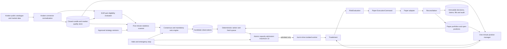
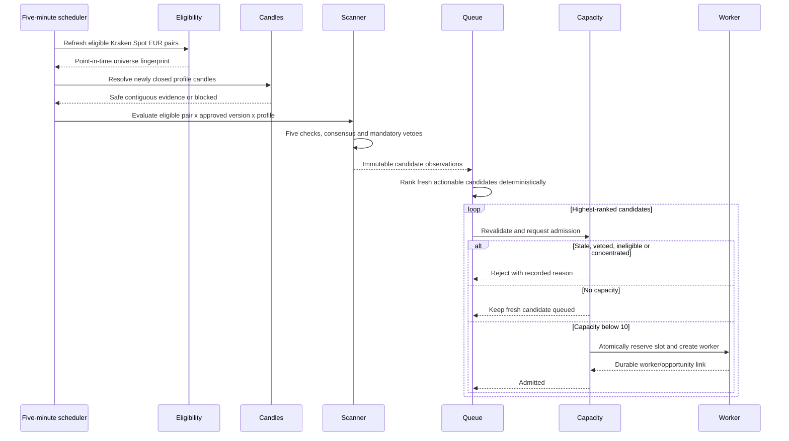
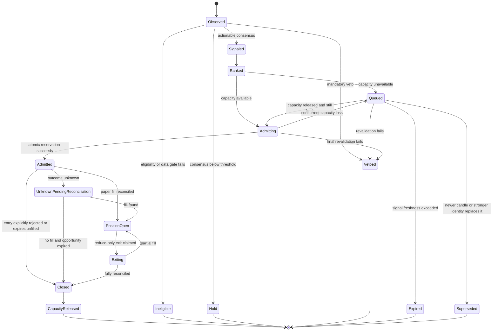

# Continuous Kraken Paper Opportunity Scanner

Status: **implemented for paper trading**. Starting paper training now enables
the scanner with zero waiting workers. The market-data host performs one
idempotent scan per closed five-minute boundary, ranks fresh opportunities, and
persists only admitted opportunities into the owner's existing activation row.
The experiment host creates isolated workers from those durable admissions.

## 1. Purpose and boundaries

The scanner continuously searches the current eligible Kraken Spot EUR
cryptocurrency universe for paper-trading opportunities. It evaluates exactly
the ten platform-authored families in `strategy-research-plan.md`. Scanning,
HOLD outcomes, bearish Spot signals, rejected signals, and queued opportunities consume **no
experiment worker slots**.

An isolated worker is created only when one concrete opportunity has passed:

1. closed-candle bullish consensus at or above the strategy's BUY threshold;
2. every mandatory veto;
3. deterministic cross-universe ranking;
4. freshness and eligibility revalidation;
5. portfolio and correlation limits;
6. bounded concentration checks; and
7. optimistic atomic admission under the ten-position ceiling.

The worker exists only for the admitted position lifecycle. It is not left
waiting on its former pair after the position is durably closed and reconciled.
Each completed scan also persists its bounded eligible-universe membership in
the activation ledger. Cross-sectional workers reuse that exact point-in-time
membership instead of silently falling back to a different fixed pair list.

This implementation is paper-only. It does not authorize live orders, Futures, shorts,
margin, leverage, transfers, withdrawals, user strategy code, or automatic
strategy approval.

## 2. Timing model

| Activity | Cadence | Evidence |
|---|---|---|
| Catalogue and eligibility refresh | Every 5 minutes and on status/data-health events | Current Kraken catalogue, exchange filters, rolling/median liquidity, spread, slippage estimate, data health |
| Opportunity scan | Every 5 minutes | Only strategy profiles with a newly closed signal candle |
| Slow regime/ranking data | On its native closed interval | Exact strategy profiles use closed 1h, 4h and 1d regime/ranking evidence |
| Active-position management | Every newly closed 1-minute candle | Stop, target, trailing, invalidation, staleness and safety state |
| UI current-price refresh | At most every minute | Latest safe closed 1-minute mark |

A scheduler tick is not a signal identity. If no new signal candle has closed,
the scanner records no new decision. All timestamps and candle boundaries are
UTC. Derived 10-minute candles contain exactly ten contiguous, safe, closed
1-minute candles aligned to a documented UTC ten-minute boundary.
Entry is modeled only after the signal candle closes. The EMA scalp profile may
use a subsequently closed 1-minute candle as execution confirmation, but a
1-minute candle never creates a directional entry signal.

## 2.1 Exact compiled strategy version

The active catalogue is version 2. It applies the attached rules directly:

- EMA continuation uses regime EMA 50/200, signal EMA 20/50, five-candle EMA
  slope, ATR-percentile veto, bounded pullback, closed recovery and volume SMA
  20.
- Donchian uses prior closed 20/55/100 channels, regime EMA 200, volume SMA 20,
  and a maximum one-ATR breakout-extension veto.
- Bollinger/RSI reversion requires ADX 14, bounded EMA 50 slope, a prior
  Bollinger 20/2 extreme, RSI 14 extreme and a later closed band re-entry. All
  five checks are required.
- RSI pullback uses regime EMA 50/200, structural validity, the bounded RSI
  pullback-and-turn rule, signal EMA 20 and volume confirmation.
- MACD acceleration uses 12/26/9 crossover and histogram acceleration, regime
  EMA 50/200, signal EMA 50 and volume confirmation.
- Compression breakout uses 100-candle percentile history, Bollinger bandwidth,
  ATR percentage, five-candle persistence, prior Donchian boundary, volume
  expansion, regime opposition and extension vetoes.
- Cross-sectional momentum ranks the complete point-in-time daily universe with
  percentile-ranked 30/90-day momentum, EMA-200 trend strength, liquidity,
  volatility, turnover stability and XBT-correlation limits.
- Relative-strength pullback combines daily rank/trend, 4-hour EMA/RSI pullback
  evidence and a closed 1-hour recovery confirmation. Ranking combines
  quote-currency return, XBT-relative return, eligible-universe-median excess
  return and volatility-adjusted return.
- Session breakout uses a versioned `America/New_York` IANA profile with
  daylight-saving conversion and requires the base breakout, session,
  liquidity, measured cost and approved-baseline checks. Until durable
  session-specific spread/slippage measurements and a walk-forward comparison
  against the no-session baseline are supplied, this family fails closed.
- Regime consensus uses daily EMA trend, trend strength, ATR, Bollinger
  bandwidth and medium-term breadth evidence. Crisis/unknown evidence vetoes
  new Spot exposure.

The version accepts only the immutable platform default parameter document
(`{}`). A non-empty or malformed parameter document is vetoed rather than
silently ignored. Changing a default or rule requires another compiled version.
Version 2 also fixes maximum holding limits at 40 EMA, 60 Donchian, 40
Bollinger/RSI, 40 RSI-pullback, 50 MACD, 50 compression, 30 daily momentum,
180 four-hour relative-strength, 60 session, and 50 regime signal candles.
Expiry submits a close through the same durable claim, decision, paper
execution, reconciliation, and audit path as every other protective exit.
Before that timeout, family-specific closed-candle invalidations cover EMA-50
failure, Donchian exit-channel failure, Bollinger middle-band completion,
RSI/EMA failure, MACD deterioration, and return inside a compression boundary.

## 3. Components



Kraken DTOs, HTTP, WebSocket, and exchange identifiers stay inside the
connector. Strategy, ranking, risk, position, and approval contracts use
exchange-neutral models.

## 4. Five-minute scan sequence



The scanner completes the bounded universe evaluation even when ten positions
are open. Capacity affects admission, not observation. This prevents idle
workers from monopolizing pairs while better opportunities appear elsewhere.

## 5. One-minute active-position sequence

```mermaid
sequenceDiagram
    participant Candle as Closed 1m candle
    participant Manager as Position manager
    participant Evidence as Approved plan evidence
    participant Risk
    participant Claims as Decision and execution claims
    participant Paper as Paper adapter
    participant Portfolio

    Candle->>Manager: Safe, contiguous, fresh closed candle
    Manager->>Evidence: Load immutable stop/target/invalidation rules
    alt Missing, stale or unresolved evidence
        Manager->>Manager: Block exposure increases; apply safety policy
    else Exit condition reached
        Manager->>Risk: Exact reduce-only TradeIntent
        Risk->>Claims: Claim closed-candle decision
        alt Existing or unknown claim
            Claims-->>Manager: Reconcile; never blind retry
        else New approved claim
            Claims->>Paper: Execute simulated reduction
            Paper->>Portfolio: Reconcile fill and update
        end
    else No exit
        Manager->>Manager: HOLD
    end
```

One-minute evidence may close or reduce an admitted Spot long. It cannot open a
position, switch strategy, add exposure, or bypass the strategy signal
timeframe.

## 6. Opportunity identity and idempotency

`OpportunityKey` is:

```text
owner
+ strategy stable id and semantic version
+ strategy content fingerprint
+ pair canonical identity
+ timeframe-profile id and version
+ signal candle open and close UTC
+ point-in-time universe fingerprint
```

The key excludes scheduler run time. Repeating a five-minute scan against the
same evidence returns the existing observation. A changed specification,
profile, pair identity, candle, or universe creates a distinct observation.
Evidence fingerprints commit to all five check outcomes, veto results,
parameters, source candle identities, cost snapshot, session profile, and
regime inputs.

Candidate observation, queue admission, strategy decision, execution claim,
and paper fill have separate durable idempotency keys. A timeout after command
submission enters `UnknownPendingReconciliation`; it is never resubmitted
until reconciliation proves no order exists.

## 7. Opportunity state model



Observations and queue rows are not workers. `Admitted` is the earliest state
that may allocate a worker.

### 7.1 Portfolio and ensemble families

Cross-sectional momentum and relative-strength rotation evaluate a complete
point-in-time universe, but emit one pair-specific opportunity per selected
asset. Their target weight is an upper bound supplied to portfolio risk, not
permission for one worker to own several assets. Each admitted asset consumes
one position context; rebalance/replacement produces pair-specific reduce-only
exits. Capacity and correlation gates may admit fewer assets than the research
portfolio requested.

Regime consensus aggregates component observations for the same pair and
timeframe profile before ranking. Components are analysis-only and allocate no
workers. Only the resulting ensemble opportunity can be admitted, creating one
worker for that pair.

## 8. Deterministic ranking and queue

Ranking is a platform policy, versioned independently from strategies. It may
use only point-in-time values:

- consensus margin above the strategy threshold;
- validation-approved signal-strength normalization;
- estimated reward-to-risk after modeled costs;
- liquidity quality and estimated slippage;
- strategy/pair/profile diversification;
- existing base-asset, quote-asset, and correlation exposure;
- signal age and remaining validity;
- turnover penalty.

It must not rank by training profit alone, use holdout data for tuning, reward a
strategy for producing more correlated signals, or infer that agreement permits
more than the risk ceiling. Decimal normalized factors are bounded from zero to
one. Stable keys provide the final tie-break.

The current hard one-worker-per-strategy activation rule does not carry into
this design. Admission first prefers actionable strategy families that are not
already represented, then lower strategy and pair concentration, before using
the original deterministic signal rank. More than one admitted pair may still
use the same approved strategy when too few other families have actionable,
non-vetoed signals. Diversity never reserves capacity for weak or HOLD signals.

Queue rules:

1. Only actionable, non-vetoed observations enter.
2. One current opportunity per strategy-version/pair/profile is retained.
3. A newer signal supersedes an older unadmitted signal.
4. Every strategy defines a maximum signal age in signal candles.
5. Capacity release triggers revalidation, not automatic execution.
6. Pair status, data freshness, checks, vetoes, spread, slippage, correlation,
   account state, and risk are recalculated before admission.
7. An opportunity that no longer passes is terminally rejected with evidence.

## 9. Capacity and worker lifecycle

- Capacity counts `Admitted`, `PositionOpen`,
  `UnknownPendingReconciliation`, and `Exiting` contexts.
- The hard platform maximum is ten per owner. User limits may be lower.
- Reservation and worker creation occur in one transaction with optimistic
  concurrency. A failed transaction leaks no slot.
- A worker receives immutable strategy, pair, profile, signal, starting fake
  balance, random seed, and approved plan references.
- Each worker has isolated cash, position, orders, strategy state, random
  state, ledger, claims, and results.
- No worker can own two pairs or two concurrent positions.
- A worker is not reassigned. Full close and reconciliation terminate it and
  release capacity; a later fresh qualifying signal creates a new worker
  identity. Previously queued observations are audit evidence and are never
  executed stale merely because capacity became available.
- One worker fault does not stop scanning or other workers. A fault with
  unresolved execution keeps its capacity reserved until reconciled.

The initial portfolio policy permits one open position per canonical pair and
blocks materially correlated exposure above configured ceilings. These are
mandatory platform gates.

## 10. Eligibility and mandatory vetoes

The general scanner evaluates only a `PaperApproved` strategy version and pairs
with a current `PaperEligible` grant for that version and timeframe profile.
The separate `ForwardPaperAuthorized` evidence harness is not a general scanner
grant. All new exposure is vetoed when any applies:

- signal candle is incomplete;
- required candles are missing, duplicated, late, out of order, stale, or
  contain unresolved gaps;
- Kraken pair is not currently online/tradable for Spot;
- tick size, quantity step, minimum quantity, or minimum notional is missing;
- spread or estimated slippage exceeds the strategy maximum;
- required warm-up is unavailable;
- reward-to-risk is below the approved minimum;
- platform, user, account, pair, or strategy halt is active;
- daily loss, drawdown, position, concentration, or exposure limit is reached;
- reconciliation is pending or an execution outcome is unknown;
- strategy approval or its supporting evidence has expired.

Kraken-specific catalogue and filter interpretation belongs to the connector.
The domain receives normalized eligibility and order-filter values.

## 11. Planned persistence

No schema in this section is implemented by this design task.

| Record | Purpose |
|---|---|
| `StrategyScanRuns` | Scheduler instant, universe/ranking versions, start/end, bounded counts and outcome |
| `StrategyCandidateObservations` | Immutable five-check and veto evidence keyed by `OpportunityKey` |
| `RankedPaperOpportunities` | Rank policy/version, score factors, queue state, expiry and rejection reason |
| `PaperOpportunityAdmissions` | Atomic capacity reservation, admitted observation and worker link |
| `StrategyVersions` | Immutable approved strategy content |
| `StrategyApprovalEvidence` | Datasets, costs, tests, gate outcomes and approvals |

Decision/fill ledgers remain separate and authoritative. Scanner retention may
be bounded, but admitted opportunity, decision, claim, fill, reconciliation,
portfolio, and audit evidence is immutable.

## 12. Monitoring and operational controls

The paper workspace should distinguish:

- scan health and latest eligible-universe fingerprint;
- candidates evaluated, held, vetoed, signaled, queued, expired and admitted;
- a read-only candidate view with bullish checks passed, the approved BUY
  threshold, checks still required, signal-close time and blocking rationale;
- queue rank factors and rejection reasons;
- capacity used out of ten;
- each admitted position's strategy version, pair, entry signal identity,
  current safe 1-minute mark, stop, target, market value, unrealized/realized
  P&L and reconciliation state;
- each fully closed round trip's weighted fee-inclusive entry, weighted exit,
  quantity, gross P&L, total fees, net P&L, return, holding time, fill counts
  and recorded exit rationale;
- stale-data and scanner/worker faults.

Disable or emergency stop blocks new admissions immediately. Existing paper
positions remain visible and follow the separately approved close-only safety
policy. Logs and telemetry contain no credentials or secret references.

## 13. Implementation gate

Runtime implementation cannot begin until:

- all ten specifications are immutable and administrator-approved for research;
- ranking, queue freshness, capacity and concentration policies are versioned;
- persistence uniqueness and concurrency constraints are reviewed;
- the validation matrix passes in design review;
- architecture tests can prove no live route is reachable; and
- migration and recovery procedures preserve every existing paper fill and
  open position.
