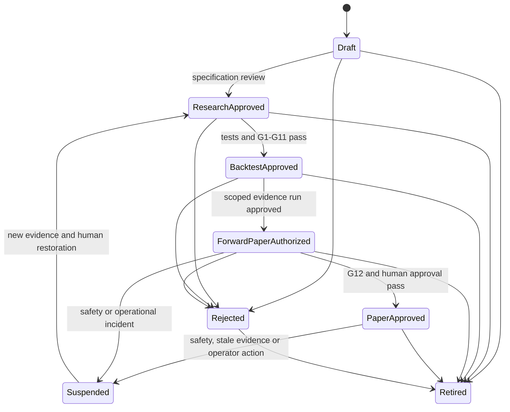
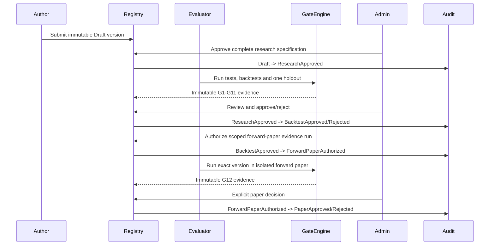

# Strategy Approval Workflow and Acceptance Criteria

Status: design only. No strategy is approved merely because it is described in
this repository. This workflow can authorize research and paper evaluation
only; live approval is unavailable.

## 1. Principles

- Strategies are platform-authored immutable specifications. Users cannot
  upload code or widen parameter bounds.
- Approval applies to one exact strategy semantic version, parameter schema,
  timeframe profile, universe policy, cost model, and evidence bundle.
- Historical return cannot approve a strategy automatically.
- The author, evaluator, and final administrator approver are separately
  recorded. Production policy may require distinct people.
- Every transition is an immutable audit event with UTC time.
- Safety suspension is immediate. Restoration requires fresh evidence and a
  new human decision.
- Paper approval never implies expected profit, financial advice, or live
  suitability.

## 2. States

`LiveApproved` and `FuturesApproved` do not exist in this workflow. The recorded
live state for every version is `NotAvailable`. A future live workflow requires
a separate design and explicit implementation review.

## 3. State requirements

### `Draft`

- Stable id and semantic version reserved.
- Complete specification fields are present.
- No research, paper, or execution eligibility.

### `ResearchApproved`

- Administrator confirms the hypothesis is falsifiable.
- Exactly five independent channels and mandatory vetoes are reviewable.
- Parameters are typed and bounded.
- Supported exchange/product/pair class/timeframe profiles are explicit.
- Warm-up, stale-data, invalidation, exits, maximum hold, sizing interface and
  failure modes are complete.
- Required tests/backtests are declared.
- Live state is `NotAvailable`.

### `BacktestApproved`

- The complete required test matrix passes.
- Reproducibility manifest is complete.
- Numeric approval thresholds were frozen before holdout.
- Gates G1-G11 in `strategy-validation-matrix.md` pass.
- Untouched holdout has been evaluated no more than once.
- Baselines and all failed/attempted configurations are recorded.
- Approval is still ineligible for general scanner admission. An administrator
  may authorize one scoped forward-paper evidence run.

### `ForwardPaperAuthorized`

- This state grants only an isolated evidence-collection run for the exact
  strategy/build/evidence candidate.
- It uses fake funds, normal risk/capacity limits, durable claims,
  reconciliation, owner isolation and audit.
- It cannot enter the general opportunity scanner, claim a live route, or
  promote itself.
- The authorization expires after its predeclared duration/trade count or any
  safety failure.
- Its only promotion is a human-approved transition to `PaperApproved` after
  G12 passes.

### `PaperApproved`

- Exact approved binaries/specifications ran through forward paper.
- Gate G12 passes for the predeclared duration and independent trade count.
- No execution-state, tenant-isolation, capacity, reconciliation, or live-route
  failure occurred.
- Current data/universe/cost evidence is within its validity period.
- An administrator explicitly approves this exact evidence bundle.

### `Suspended`

New admissions stop immediately. Causes include expired evidence, stale or
unsafe data, operational fault, unexplained performance drift, breached risk
limit, changed exchange behavior, audit failure, or operator action. Existing
paper positions follow the approved close-only/emergency policy and remain
visible. Suspension never deletes evidence.

### `Rejected` and `Retired`

`Rejected` records a failed review or gate with immutable reasons. `Retired`
ends future use without rewriting past decisions. Neither state can be edited
back into approval; a changed proposal is a new semantic version.

## 4. Version-change rules

Any of these requires a new strategy version and full reapproval:

- signal-channel logic or vote threshold;
- veto, entry, exit, invalidation, maximum hold, or stale-data behavior;
- indicator definition or warm-up;
- parameter type, default, bound, or dependency;
- supported pair class, product, exchange, mode, or timeframe profile;
- derived-candle or session/timezone behavior;
- sizing interface or risk geometry;
- fee, spread, slippage, latency or fill assumptions;
- ranking interaction or component mapping in an ensemble.

Correcting prose that cannot affect behavior may create a documentation
revision without strategy reapproval, but the approval record still references
the exact documentation hash reviewed.

## 5. Evidence bundle

An approval request is rejected as incomplete unless it contains:

| Evidence | Required content |
|---|---|
| Specification | Stable id, version, content/schema/profile fingerprints |
| Build | Source commit, build identity, compiler/runtime and test results |
| Data | Dataset, point-in-time universe, classification and candle fingerprints |
| Partitions | Training, validation, walk-forward, embargo and holdout UTC boundaries |
| Costs | Fees, spread, slippage, latency, filter and fill-model versions |
| Search | All attempted parameters and random seed |
| Results | Metrics, uncertainty, pair/trade/regime attribution and benchmarks |
| Gates | Measured value, frozen threshold, pass/fail and reason for G1-G12 |
| Stress | Parameter neighborhood, fee, spread, slippage, latency, liquidity and combined stress |
| Paper | Decisions, claims, fills, reconciliation, restart, capacity and safety evidence |
| Review | Author, evaluator, approver, UTC events, comments and conflicts |

Secrets, credentials, signed requests, API keys and secret references are
forbidden in evidence.

## 6. Approval sequence

The service account running tests may record evidence but cannot approve it.
Changing evidence after signature invalidates the request.

## 7. Scanner admission relationship

`ForwardPaperAuthorized` uses a separately scoped evidence harness and is not
eligible for the general scanner. `PaperApproved` makes a version eligible for
scanner consideration; it does not allocate a worker or open a position. The
continuous scanner still requires:

1. current strategy `PaperApproved` state and pair/profile `PaperEligible`
   grant;
2. newly closed signal evidence;
3. required consensus and no veto;
4. fresh deterministic ranking;
5. portfolio/concentration and risk approval; and
6. atomic capacity below ten.

Scanner observations and queued opportunities use no workers. Admission creates
one isolated worker just in time. Suspension removes the strategy from new
scans and queued admission immediately.

## 8. Authorization and audit

- `StrategyAuthor` may submit a Draft but not approve it.
- `ResearchEvaluator` may attach signed evidence but not approve it.
- `Administrator` may approve research/backtest/paper transitions.
- `RiskOfficer` may approve paper risk policy and suspend immediately.
- Administrator MFA is required by deployment policy.
- Owner, strategy and evidence access is authorization-scoped.
- Audit events are append-only and include actor, role, prior/new state,
  strategy version, evidence hash, reason, correlation id and UTC timestamp.
- Failed and unauthorized transitions are audited without leaking protected
  resource existence.

## 9. Expiry and ongoing review

Approval validity is versioned policy. At minimum, reevaluate on:

- scheduled evidence expiry;
- Kraken catalogue/filter or fee changes;
- pair eligibility degradation;
- strategy or scanner software change;
- data-quality incident;
- unexplained paper drift;
- duplicate/unknown execution or reconciliation incident;
- risk-policy or capacity-policy change;
- session profile/IANA database change.

Expiry or a safety incident suspends new admissions. It cannot silently extend
approval based on old results.

## 10. Design acceptance criteria

This documentation phase is accepted only when:

1. Exactly ten family contracts contain every required field.
2. Each family has exactly five explainable channels and explicit consensus,
   HOLD, Spot SELL, veto, entry, exit, invalidation and maximum-hold behavior.
3. Supported intervals include native 1m/5m/15m/30m/1h/4h/1d and derived 10m
   where a profile approves them; no incomplete candle can signal.
4. The continuous scanner evaluates the eligible Kraken Spot EUR universe
   every five minutes without preallocating workers.
5. HOLD, bearish Spot, vetoed, rejected and queued opportunities allocate zero workers.
6. A worker is created atomically only for an admitted concrete opportunity,
   and capacity cannot exceed ten concurrent admitted/open positions.
7. Open positions are managed every minute from safe closed 1-minute candles,
   while one-minute management cannot open or add exposure.
8. Queue admission revalidates freshness, eligibility, consensus, vetoes,
   costs, concentration and risk.
9. The test matrix covers every family, interval, approval gate, scanner state,
   concurrency invariant, restart, reconciliation and paper-only boundary.
10. The backtest plan prevents look-ahead, survivorship, holdout optimization,
    unrealistic fills and selection by total profit alone.
11. Approval is immutable, human-gated, audited, version-specific and cannot
    reach a live state.
12. Future persistence defines unique identities, optimistic concurrency,
    owner isolation, UTC timestamps and immutable admitted execution evidence.
13. Existing durable workers, positions, claims and fills are preserved by any
    future migration.
14. No document claims profit, provides financial advice, or treats a passing
    strategy as guaranteed.

## 11. Runtime implementation entry gate

No scanner or strategy runtime implementation should begin until an
Administrator and RiskOfficer approve these documents, the proposed database
constraints, the migration/recovery plan, and the architecture proof that no
live execution route is reachable.
